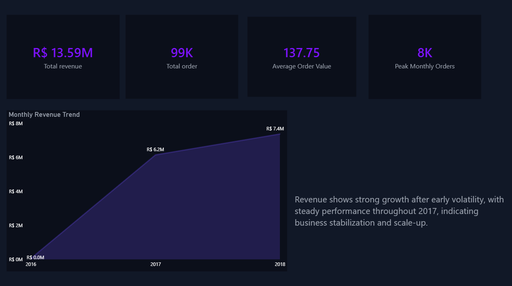
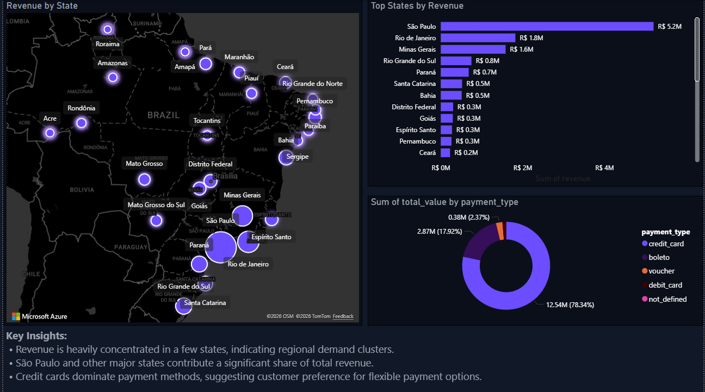

# 🛒 Olist E-commerce Analysis (Brazil)

## 📌 Project Overview
This project analyzes **Olist**, a large Brazilian e-commerce marketplace, to uncover **business performance, customer behavior, product trends, and regional revenue insights**.

The analysis uses **SQL for data aggregation** and **Power BI for visualization**, with a strong focus on **executive-level decision making**.

The goal is to transform raw transactional data into **clear, actionable insights** suitable for business stakeholders.

---

## 🧰 Tools & Technologies
- **SQL (MySQL)** – Data cleaning, joins, aggregations, and KPI calculations  
- **Power BI** – Interactive dashboards and data storytelling  
- **CSV / Excel** – Intermediate data exports  
- **GitHub** – Version control and project documentation  

---

## 📊 Dashboard Structure
The Power BI report consists of **three focused pages**, each designed for a specific analytical purpose.

---

### 1️⃣ Executive Overview
A high-level snapshot for decision-makers.

**Key Metrics**
- Total Revenue  
- Total Orders  
- Average Order Value (AOV)  
- Peak Monthly Orders  

**Insights**
- Revenue shows strong growth after early volatility  
- Business stabilizes and scales significantly during 2017–2018  
- Clear indication of increasing marketplace maturity  

---

### 2️⃣ Product & Customer Insights
Deep dive into what sells and who buys.

**Analysis Includes**
- Top product categories by revenue  
- Top product categories by sales volume  
- One-time vs repeat customer distribution  
- Top customers by revenue contribution  

**Key Findings**
- Revenue is concentrated in a few categories (Beauty, Watches, Furniture)  
- Sales volume does not always align with revenue, indicating premium vs low-margin categories  
- Majority of customers are one-time buyers, highlighting retention opportunities  

---

### 3️⃣ Regional & Payments Analysis
Geographical and payment behavior analysis.

**Analysis Includes**
- Revenue distribution across Brazilian states  
- Top-performing states by revenue  
- Payment method contribution to total revenue  

**Key Findings**
- Revenue is heavily concentrated in São Paulo and major urban states  
- Credit cards dominate payment methods, indicating preference for flexible payments  
- Regional demand clusters suggest targeted growth opportunities  

---

## 🧠 Data Modeling Approach
- Data was **pre-aggregated in SQL** to improve performance and clarity  
- Power BI was used primarily for **visualization and business logic**  
- A dedicated **Measures table** was created to centralize KPI calculations  
- This approach reflects **real-world BI workflows**, where SQL handles heavy transformations  

---

## 📁 Project Structure
```text
Olist-Ecommerce-Analysis/
│
├── powerbi/
│   └── Olist_Ecommerce_Analysis.pbix
│
├── sql/
│   └── analysis_queries.sql
│
├── exports/
│   └── *.csv
│
└── README.md

---

## 📸 Dashboard Screenshots

### 1️⃣ Executive Overview


### 2️⃣ Product & Customer Insights


### 3️⃣ Regional & Payments Analysis


